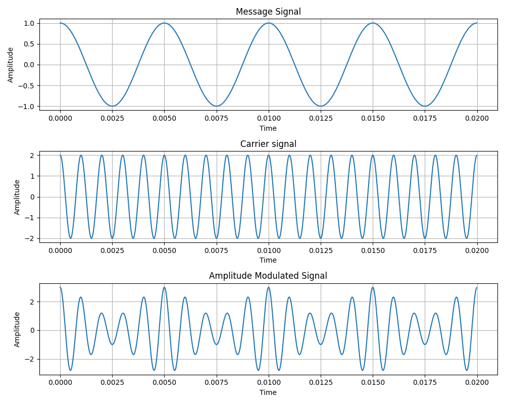
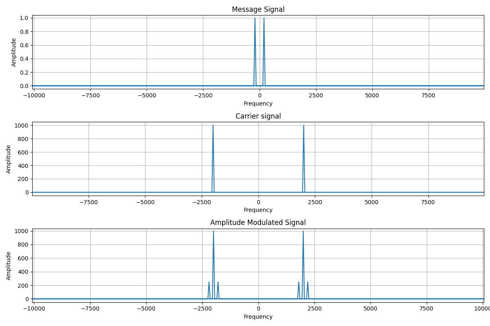

# 📡 Amplitude Modulation (AM) - Time & Frequency Domain

This project demonstrates **Amplitude Modulation (AM)** signals in **time and frequency domains** using Python, NumPy, and Matplotlib.  

Two scripts are included:  

- 🕒 `am_with_time_domain.py` — visualize signals in **time domain**  
- 📊 `am_with_freq_domain.py` — visualize signals in **frequency domain** using FFT  

---

## 📝 Files Overview

### 1️⃣ `am_with_time_domain.py`
This script plots three signals in the **time domain**:

- **Message Signal**: The main signal to be modulated  
- **Carrier Signal**: High-frequency carrier wave  
- **Amplitude Modulated Signal (AM)**: Combination of message and carrier signals  

### **Example Output:**  

  

---

### 2️⃣ `am_with_freq_domain.py`
This script shows the **frequency spectrum** of the same signals using FFT (Fast Fourier Transform):

- **Message Signal FFT**  
- **Carrier Signal FFT**  
- **AM Signal FFT**  

This helps visualize the **main frequency peaks** and **sidebands** of the AM signal.  

### **Example Output:**  

  

---

## 🔢 Signal Formulas

The signals are mathematically defined as:

### 🔹 **Message Signal**

  

### 🔹 **Carrier Signal**

  

### 🔹 **Amplitude Modulated (AM) Signal**

  

These are the exact formulas used in your Python scripts.

---

## ⚙️ Parameters

| Parameter | Description |
|-----------|-------------|
| `fs`      | Sampling frequency (Hz) |
| `T`       | Signal duration (seconds) |
| `fm`      | Message signal frequency (Hz) |
| `Am`      | Message signal amplitude |
| `fc`      | Carrier signal frequency (Hz) |
| `Ac`      | Carrier signal amplitude |

---

## 🔹 NumPy FFT Explanation

- `np.fft.fft(x)`  
  - Computes the **frequency domain** representation of signal `x` (complex output)  
  - Shows all frequency components of the signal  

- `np.fft.fftfreq(n, d=1/fs)`  
  - Returns the **frequency bins** corresponding to the FFT output  
  - `n` is the number of samples, `d` is the sample spacing (`1/fs`)  
  - Helps **plot the FFT results correctly on the frequency axis**  

---

## 🚀 How to Run

```bash
# Time domain visualization
python am_with_time_domain.py

# Frequency domain visualization
python am_with_freq_domain.py